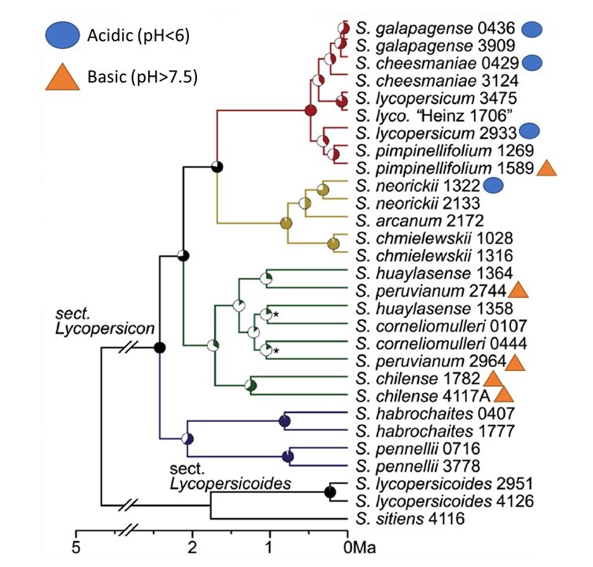
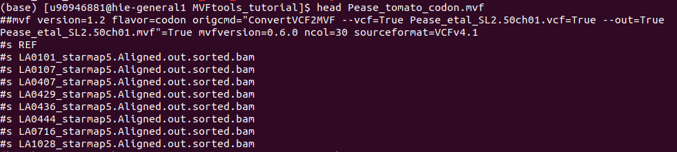
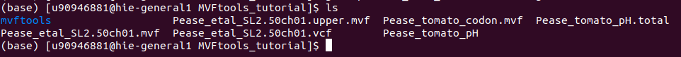

# PhyloJaltoWorkflow
A "reduced" version of the [PhyloGWAS project](https://github.com/wum5/JaltPhylo) by Pease et al. to practice on the workflow, packages and functions.

## Summary
PhyloGWAS leverages shared variance among related species to infer trait evolution among species. The analysis workflow combines GWAS-type mapping approach with phylogenetics models to understand the complex evolution of traits. Because genetic variants are rarely found segregating in wild populations, hybrid phylogenetic-mapping approaches are applied to entire clades in order to identify segregating variants, across species, responsible for trait variation.For instance, by applying ‘PhyloGWAS’ in a clade of wild tomato species resulting from a recent radiation event, Pease et al. (2016) identified genetic variants associated with traits like fruit colour and environmental variability. Additionally, PhyloGWAS presents advantages in clades with ILS by mapping phenotypic trait variation to the segregation of ancient polymorphism thereby avoiding risks of [hemiplasy](https://academic.oup.com/sysbio/article/57/3/503/1666092). This approach can provide the analytic power necessary for identifying genetic regions associated with trait variation in closely-related species.

## Table of content
 * [Outline](#outline)
 * [Dataset](#dataset)
 * [Requirements](#requirements)
 * [Format conversion with MVFtools](#format-conversion-with-mvftools)
 * [Find nonsynonymous variants correlated with a trait](#find-nonsynonymous-variants-correlated-with-a-trait)

## Outline
In this tutorial, I will present the use of a few functions of the program [MVFtools](https://github.com/peaselab/mvftools) ([Pease and Rosenzweig 2018](http://www.dx.doi.org/10.1109/tcbb.2015.2509997)) necessary for the downstream PhyloGWAS test, using command lines in a Unix/Linux environment. First,  will demonstrate how the conversion from a VCF file to a MVF format is done. Then, I will show how the MF file is converted to a codon format, which will be used for the final step of this short tutorial, finding nonsysnonymous variants associated with a trait.
 
## Dataset
For computational reasons, I will use a subset of the whole data set and use the VCF file of the chromosome 1 of the tomato data available from the original paper on the [Dryad repo](https://datadryad.org/stash/dataset/doi:10.5061/dryad.182dv). The file contains the combined VCF for all 29 accessions for chromosome 1. You will need to download the file on your own as it is too heavy to include in this repository.
For more information on the dataset please read the original paper ([Pease et al. 2016](https://journals.plos.org/plosbiology/article?id=10.1371/journal.pbio.1002379)).

## Requirements
 * **MVFtools**: Clone the MVFtools repository with the following command: `git clone https://github.com/peaselab/mvftools.git`. To see the requirements of MVFtools see the section 'Requirements' in the MVFtools repository at https://github.com/peaselab/mvftools.
 * **Python**: A Python version >3 will work. At the time of this tutorial preparation I was using Python 3.8.3.

## Format conversion with MVFtools

Download the file `Pease_etal_SL2.50ch01.vcf.gz` and move it in the `PhyloJaltoWorkflow/` directory. `gunzip` to obtain the full .vcf file.

If you didn't do so already, clone the MVFtools repo in the same directory as the data.
```
git clone https://github.com/peaselab/mvftools.git
```

My cluster doesn't use a job management system so I run the code in screen mode but if you do, you can imbed the following command in a bash script and specify the job characteristics (the job is a bit computationaly demending, I would recommand specifying 2h for the walltime). Otherwise simply copy/paste and run the following command in screen mode.
```
python3 mvftools/mvftools.py ConvertVCF2MVF --vcf Pease_etal_SL2.50ch01.vcf --out Pease_etal_SL2.50ch01.mvf
```
The ConvertVCF2MVF function is quite straight forward, we use the .vcf file as the data input and obtain a .mvf file as the output. If you have contigs in separate VCF files, you can create a bash script for each file and run them in parallel. The resulting MVF file is 667 MB (type `ls -lh` to check).
Some extra arguments to ConvertVCF2MVF that might be helpful:
 * `--contig-ids`: if you have a single VCF file with your whole genome assembly, you can parallelize the conversion to MVF by passing specific contigs to this argument in individual jobs
 * Various depth and quality filters/maskers if you haven’t already done this in the VCF file.

The MVF format is basically a highly condensed version of VCF which only contains alleles for each sample with a compact representation. The function randomly chooses between the reference and alternative alleles for heterozygotes (which can be a good or a bad thing depending how you look about it, for example if an alternative allele that is from ancient standing variation this may not be advantageous...). The conversion from VCF returns a DNA format MVF which we need to convert to codon format to feed to PhyloGWAS.

Sometimes MVFtools will return a file containing lowercase bases which we need to convert to uppercase for translation. But that's an easy fix. Simply run the following command, or same as above, include it in a bash script.
```
python3 mvftools/mvftools.py FilterMVF --actions promotelower --mvf Pease_etal_SL2.50ch01.mvf --out Pease_etal_SL2.50ch01_upper.mvf
```
This should be fast, it took me 6min to finish.
Now we can convert our mvf file to codon format with this command:
```
python3 mvftools/mvftools.py LegacyTranslateMVF --mvf Pease_etal_SL2.50ch01_upper.mvf --out Pease_tomato_codon.mvf --output-data codon
```
This step can also be parallelized with multiple MVF files. Note that I used the legacy function here, this is because it doesn’t require a `.gff` file and can assume in-frame coding sequences. If you have gene/CDS annotations in a `.gff` file, this can be provided with the option `–gff` using the current `TranslateMVF`.
 * With a gff file, use `–filter-annotation` to skip entries with the specified text in the “notes” section.
 * Also, the function `--line-buffer` adjusts the number of entries stored in memory at a time, if you’re having memory issues.

## Find nonsynonymous variants correlated with a trait
For the exercise we will do only the interpolated water pH contrast from the paper. This is the information from the supplementary data of the paper:
"Interpolated water pH: 9 accessions total were tested (4 from “acidic” environments (pH ≤ 6); 5 from “basic environments (pH ≥ 7.5). Acidic accessions are che¬-0429, gal-0436, lyc-2933, and neo-1322. Basic accessions are pim-1589, chi-1782, per-2744, per-2964, and chi-4117."

Now let's find the correlated alleles associated with the interpolated water pH on chromosome 1. The pH variable is split as a binary trait with acidic (pH <6) and basic (pH >7.5). We use the accession numbers as the sample names. The input trait values to MVFtools looks something like this: ACIDIC:0436,0429,2933,1322 BASIC:1589,2744,2964,1782,4117A with the accession name associated with the trait value (picture as a visual).



Let's have a look at the `Pease_tomato_codon.mvf` file:

All bam files follow the same structure : `LA*_starmap5.Aligned.out.sorted.bam`.

The next command is a big mouthfull but it is only because of the long names of the bam files within the `Pease_tomato_codon.mvf` file.
If we take a look at the `InferGroupSpecificAllele` function we have the following arguments:
 * `--mvf` for the input mvf file
 * `--out` for the output file
 * `--allelegroups` to specify which accession fall in each trait category
 * and finally `--speciesgroups` to specify a name for the accessions

Now copy/paste the command in your terminal:
```
python3 mvftools/mvftools.py InferGroupSpecificAllele --mvf Pease_tomato_codon.mvf --out Pease_tomato_pH --allelegroups ACIDIC:LA0436_starmap5.Aligned.out.sorted.bam,LA0429_starmap5.Aligned.out.sorted.bam,LA2933_starmap5.Aligned.out.sorted.bam,LA1322_starmap5.Aligned.out.sorted.bam BASIC:LA1589_starmap5.Aligned.out.sorted.bam,LA2744_starmap5.Aligned.out.sorted.bam,LA2964_starmap5.Aligned.out.sorted.bam,LA1782_starmap5.Aligned.out.sorted.bam,LA4117_starmap5.Aligned.out.sorted.bam --speciesgroups GAL:LA0436_starmap5.Aligned.out.sorted.bam CHE:LA0429_starmap5.Aligned.out.sorted.bam LYC:LA2933_starmap5.Aligned.out.sorted.bam NEO:LA1322_starmap5.Aligned.out.sorted.bam PIM:LA1589_starmap5.Aligned.out.sorted.bam PER:LA2744_starmap5.Aligned.out.sorted.bam PER:LA2964_starmap5.Aligned.out.sorted.bam CHI:LA1782_starmap5.Aligned.out.sorted.bam CHI:LA4117_starmap5.Aligned.out.sorted.bam
```
The job took only 2min for me, and results with two files:



This should return counts of sites matching the specified trait pattern. We obtain 11 nonsynonymous changes for chromosome 1 that are associated with water pH.
