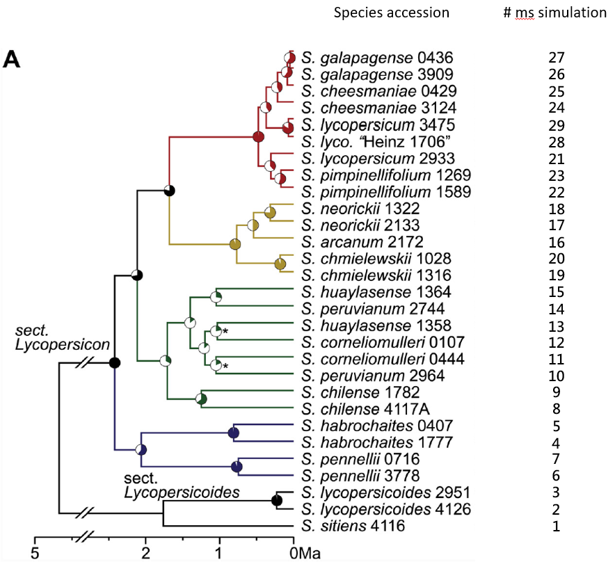

# PhyloGWAS test with the ms command

## Table of content
 * [Outline](#outline)
 * [Dataset](#dataset)
 * [Requirements](#requirements)
 * [Converting branch lengths to coalescent units from an ultrametric phylogeny](#converting-branch-lengths-to-coalescent-units-from-an-ultrametric-phylogeny)
 * [Building the *ms* command ](#building-the-*ms*-command)
 * [Evaluating the significance from *ms* output](#evaluating-significance-from-*ms*-output)

## Outline
The PhyloGWAS test for trait-specific sequence differences uses the program *ms* ([Hudson 2002](https://academic.oup.com/bioinformatics/article/18/2/337/225783)) to determine if the number of nonsynonymous calls that show the same pattern as the trait binaries for the accession groups (from the MVFtools step) is greater than expected under a null hypothesis.
In this tutorial, I will show how to build the *ms* command and define the different arguments used. Then, I will show the use of the PhyloGWAS python script to evaluate the output of the *ms* simulation.

## Dataset
I will be using the non synonymous calls output file on chromosome 1 from the MVFtools tutorial. The simulation requires branch lengths in coalescent units for the 14 accessions. In this case we will be using the best maximum-likelihood quartet-based phylogeny provided by [Pease et al.](https://journals.plos.org/plosbiology/article?id=10.1371/journal.pbio.1002379). 

## Requirements
 * ***ms* program**: Go to the page http://home.uchicago.edu/~rhudson1/source/mksamples.html, follow the link to the `ms.folder` and download the file `ms.tar.gz`. To get the software working move `ms.tar.gz` to your `/bin` folder then run the following commands:
```
gunzip ms.tar.gz
tar -xvf ms.tar
cd msdir
gcc -o ms ms.c streec.c rand1.c -lm
```
This should compile the programs and you should see a `ms` folder in there.
If the last command doesn't work try `cc -o ms ms.c streec.c rand2.c -lm`.

## Converting branch lengths to coalescent units from an ultrametric phylogeny
 
This step is not necessary for the tomato data but will be for the eucs data. This part will be developped after building the best ML quartet-based phylogeny. :seedling:
 
## Building the *ms* command
I made a script and pasted the *ms* command of Pease et al. available in the supplementary material under "PhyloGWAS analysis":


Note: I kept the line breaks in this picture but it might be necessary to remove them to run *ms*.

 * The first two numerical arguments specify the number of individuals per locus (58) and the number of loci ($10^9$). In Pease et al. and Wu et al., these very large simulated datasets are partitioned into smaller ones later on to test significance. In our example in tomato chromosome 1, there were **53,748 variable amino acid sites**, so this simulated dataset would be broken up into many smaller ones of 53,748 each.


 * `-s 1` means each locus contains an individual variable site; so really, we are simulating 10^9 independent variable sites.
 * `-I` is used to specify population structure; since this is a phylogeny, we specify 29 populations with 2 samples from each one (29 2’s)
 * the `-ej` commands are used to specify population joining events but considering our input data, this will be translated in speciation times. For example, `-ej 0.6852423 13 12` means that lineage 13 joins to lineage 12 at time 0.6852423.
 * To construct these commands, you will need an ultrametric phylogeny of the relevant species, and some way to convert the branch lengths to coalescent units.

The command requires a species:number key. After lineage joining events, the ancestral population takes on the smaller numerical ID. For example in Pease's case, the ancestral population of 13 and 12 is 12 after time 0.6852423 in the past.

Find under the species accession:number key for the ms simulation in Pease's 
Accession | Number key
----|---
S. lycopersicum  3475|29
S. lyco “Heinz 1706”|28
S. galapagense 0436|27
S. galapagense 3909|26
S. cheesmaniae 0429|25
S. cheesmaniae 3124|24
S. pimpinellifolium 1269|23
S. pimpinellifolium 1589|22
S. lycopersicum 2933|21
S. chmielewskii 1028|20
S. chmielewskii 1316|19
S. neorickii 1322|18
S. neorickii 2133|17
S. arcanum 2172|16
S. huaylasense 1364|15
S. peruvianum 2744|14
S. huaylasense 1358|13
S. corneliomulleri 0107|12
S. corneliomulleri 0444|11
S. peruvianum 2964|10
S. chilense 1782|9
S. chilense 4117A|8
S. pennellii 0716|7
S. pennellii 3778|6
S. habrochaites 0407|5
S. habrochaites 1777|4
S. lycopersicoides 2951|3
S. lycopersicoides 4126|2
S. sitiens 4116|1



Important: ms uses units of **4N generations** instead of the standard 2N for coalescent units. Differences in effective population size can be incorporated by rescaling the branch lengths.

To run the script change the path to the *ms* software in the `$OD` variable, as well as the path specified for `cd` where you want the output to be saved. The job might take a while so it's good to have it running overnight.
This script will simulate over the full phylogeny (27 accessions as you can see on the script), then we can pull the relevant accessions out of the full simulated dataset to test for the pattern of a trait. The specific accessions are given with the species:number key; we see how it's done in the following section.

## Evaluating the significance from *ms* output

The *ms* simulation output is used to run the `phyloGWAS_pval.py` python script which will evaluate the significance of the output from the *ms* simulation.
The script is available in the `/src` folder:


The script takes four arguments:
* `-i` the codon MVF file
* `-m` for the output ms file
* `-p` for the expected trait pattern, the argument should be a string of binaries specifying the trait's character for each tested accessions in ascending order of the phylogeny.
* `-n` which is the expected number of matching sites as observed in the empirical data.

The original script in Wu and Pease's papers is written in python2. For the reproducible/transposable pipeline use on eucs data, the script will be written in python3 for simplicity. The script for the eucs data will contain modifications:
 * As stated above, the script will be written in python3 not python2
 * Then, there will be the possibility to have a binary trait string with a differing number of accession compared to the phylogeny included in the ms simulation, giving the possibility to try variant calling for a differing number of accessions. This is not an option in the original script where the binary string needs to be the same length as the number of accessions (each accession included in the ms simulation needs to have a trait character to be tested with phyloGWAS).
 * Additionally the original script does not check if the binary string length matches the number of accessions tested. Therefore no error message pops up to state if the string is a different length and the binary trait data is not provided for all species. This is particularly risky for long strings, where it is easy to include a coding error as the binary string is included manually. The script for the eucs data will contain additional coding to put this as a requirement to run the script.

`python3 src/phyloGWAS_pval.py  -i data/tomato_codon.mvf -m ms_sim_tomato_ch1.txt -p 000101111 -n 11`
